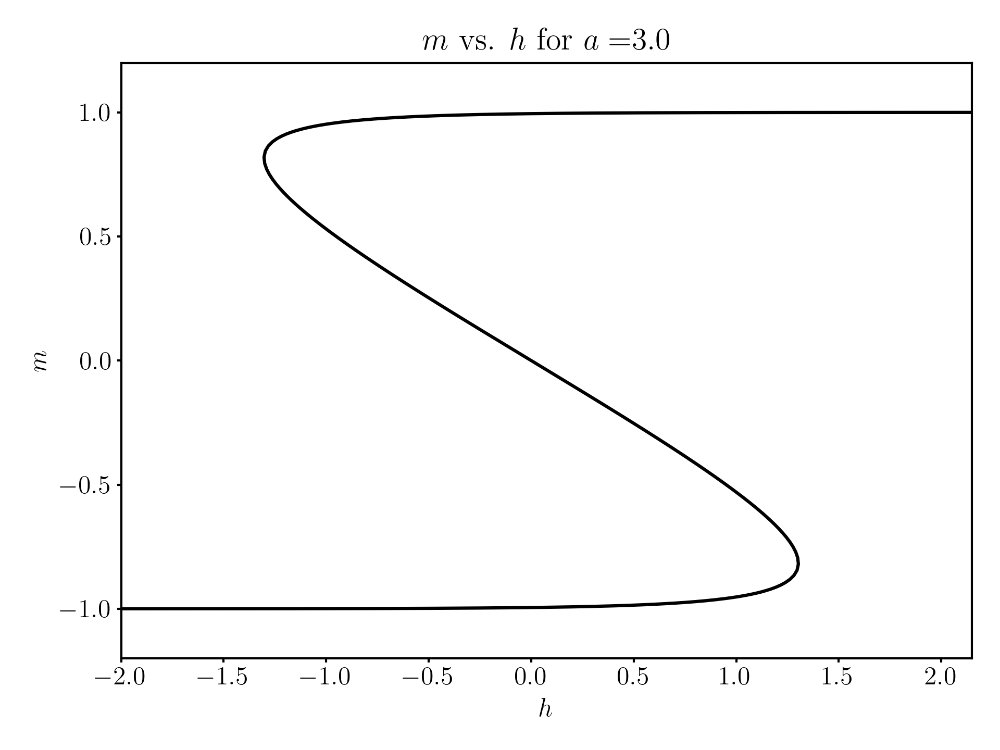

## Interacting Ising Model with External Field
This is an implementation of the Ising model with an external field in the mean-fied approximation. The source code is located in ```src/ising.py```. The model is implemented in the ```Ising``` class which is called in ```main.py```. To run the code from this directory simply call from the command line:
```
$ python main.py
```
### Input Parameters
A few parameters can be changed within the input file ```input/input.json```.
```
{
    "a": 3.0,
    "h0": -2.0,
    "dh": 0.025,
    "steps": 400,
    "mixType": "anderson",
    "anderM": 3,
    "errorTol": 1e-10
}
```
The parameters are:
- ```a```: The coupling constant of the Ising model ($\xi$ in the notes and paper)
- ```h0```: The initial value of the external field
- ```dh```: The step size for the external field
- ```steps```: The number of steps to take in the external field during continuation
- ```mixType```: The type of mixing to use for the fixed point iteration. Options are limited to ```anderson``` which is anderson acceleration.
- ```anderM```: The number of previous iterations to use in the anderson acceleration
- ```errorTol```: The tolerance for the fixed point iteration

### Output
The output of the code is a text file ```output/params.dat``` which contains the parameters at each step of the continuation. The columns are:

0. Step number
1. External field value ($h$)
2. Magnetization ($m$)
3. The pseudo-arclenth value ($s$)
4. The turn count. This is the number of times the continuation has turned around in the $h-m$ plane. This is used to determine if there has been any turning points, and is helpful for plotting the different branches in the continuation path.

Below is a plot from the default example.


### Theory
The interacting Ising model can be solved easily in the mean-field approximation. The mean-field free energy derived in the paper is given by:

$$f=-\frac{1}{2}\alpha m^2 - \bar hm + \left[\frac{1+m}{2}\ln\frac{1+m}{2}+\frac{1-m}{2}\ln\frac{1-m}{2}\right]$$

where $\alpha$ is the coupling constant, $m$ is the magnetization, and $\bar h$ is the external field. The equilibrium condition is found by minimizing the variational free energy with respect to the order parameter $m$. This gives the self-consistent equation:

$$\frac{\partial f}{\partial m}=-\alpha m - \bar h +\frac{1}{2}\ln\left(\frac{1+m}{1-m}\right)=0$$

This cannot be solved for $m$ analytically, so one must used a fixed point iteration scheme. It also turns out that when $\bar h$ is sufficiently small, there can be multiple thermodynamically stable solutions (one pointing up and one pointing down). To solve for the full path of solutions $m$ vs $\bar h$, we use our Jacobian-Free Pseudo-Arclength Continuation method proposed in the paper.
