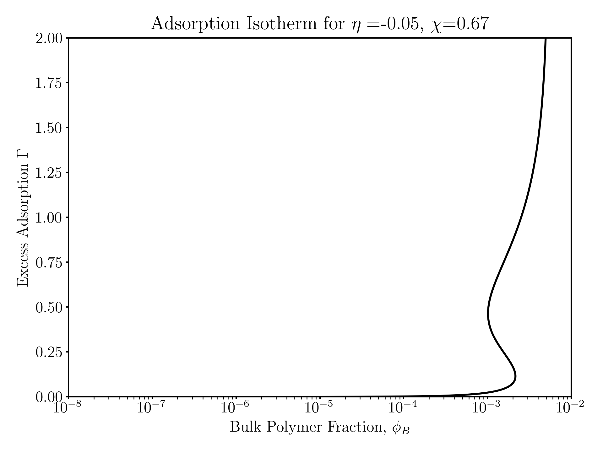

## Flory Solution near a Solid Surface
This folder contains the numerical routines to calculate the polymer density profile of a Flory solution (polymer + solvent interacting via a $\chi$ parameter) near a solid surface. The source code is located in ```src/gsd.py```. The model is implemented in the ```GSD``` class which is called in ```main.py```. To run the code from this directory simply call from the command line:
```
$ python main.py
```
### Input Parameters
A few parameters can be changed within the input file ```input/input.json```.
```
{
    "eta": 3.0,
    "chi": -2.0,
    "phiB0": 0.025,
    "steps": 350,
    "anderM": 8,
    "errorTol": 1.0e-6
}
```
The parameters are:
- ```eta```: Parameter for the effective polymer-surface interaction (negative indicates attractive)
- ```chi```: Flory-Huggins $\chi$ parameter for the polymer solvent pair
- ```phiB0```: The starting volume fraction of polymer
- ```steps```: The number of steps to take in the arc-length calculation
- ```anderM```: The number of previous iterations to use in the anderson acceleration
- ```errorTol```: The tolerance for the fixed point iteration

### Output
The output of the code is a text file ```output/params.dat``` which contains the parameters at each step of the continuation. The columns are:

0. Step number
1. Bulk Polymer Volume Fraction ($\phi$)
2. Excess Adsorption of polymer ($\Gamma_p$)
3. The pseudo-arclenth value ($s$)
4. The turn count (i.e. number of turning points)

Below is a plot from the default example.
